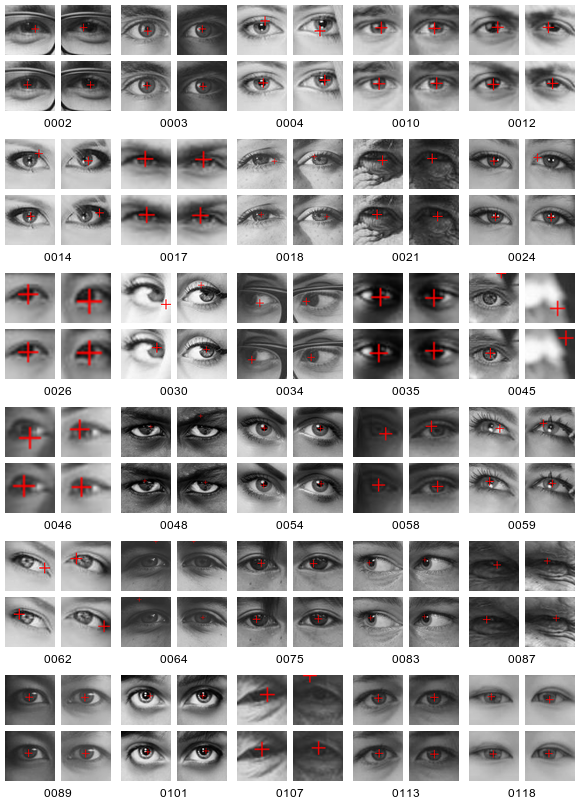
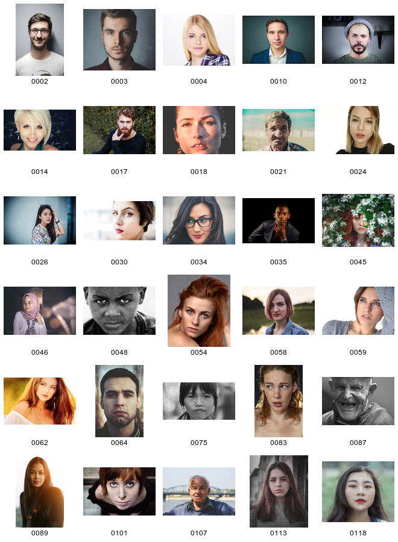

# `pupil_detection_comparison.png`

The individual groups of four images show eyeLike's results in the top row and Gaze's results in the bottom row, the eyes are ordered as they are in the original images. The position of each group matches the position of the original image in the figure below.

# `pupil_detection_faces.png`

